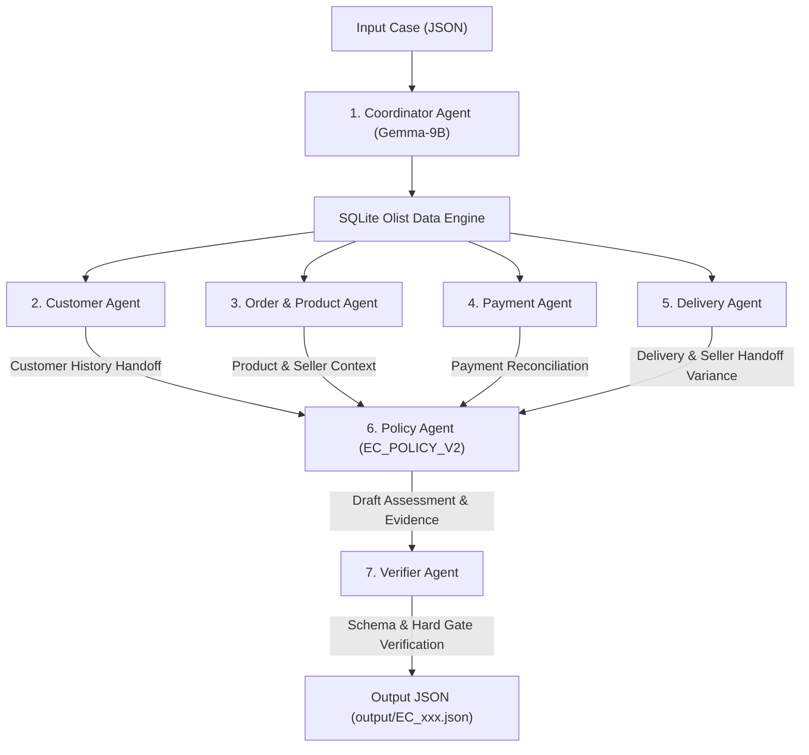

# Multi-Agent E-commerce Dispute Resolution Architecture

## 1. System Overview

Hệ thống được thiết kế theo kiến trúc **7 Agents chuyên biệt hóa** (vượt yêu cầu tối thiểu 5 Agents) để xử lý 50 ca khiếu nại thương mại điện tử Olist theo quy tắc nghiệp vụ `EC_POLICY_V2`, chạy mô hình **Gemma-2-9B** ($\le$ 10B parameters).

Các Agent hoạt động độc lập theo quy trình handoff bằng chứng minh bạch, được điều phối bởi `CoordinatorAgent` và kiểm soát chất lượng bởi `VerifierAgent`.

---

## 2. Danh sách 7 Agents Chuyên biệt (Roles & Permissions)

| # | Agent Name | File đại diện | Vai trò & Trách nhiệm chính | Quyền đọc Dữ liệu | Đầu ra Handoff |
| :-: | :--- | :--- | :--- | :--- | :--- |
| **1** | **CoordinatorAgent** | [`coordinator.py`](file:///C:/Users/DELL/Documents/GitHub/K4-Day9-2A202601224-HoangTruongGiang/src/agents/coordinator.py) | Điều phối trung tâm, nhận case JSON, giao việc cho 5 sub-agents và quản lý luồng handoff | `input/*.json`, `orders`, `customers` | Phân công công việc & tổng hợp candidate JSON |
| **2** | **CustomerAgent** | [`customer_agent.py`](file:///C:/Users/DELL/Documents/GitHub/K4-Day9-2A202601224-HoangTruongGiang/src/agents/customer_agent.py) | Tra cứu `customer_unique_id` và xác định lịch sử order đã mua trước đó | `customers`, `orders` | `customer_context` (`customer_unique_id`, `related_order_ids`, `repeat_customer`) |
| **3** | **OrderProductAgent** | [`order_product_agent.py`](file:///C:/Users/DELL/Documents/GitHub/K4-Day9-2A202601224-HoangTruongGiang/src/agents/order_product_agent.py) | Kiểm tra chi tiết đơn hàng, món hàng, seller, mã sản phẩm và tên danh mục gốc (Bồ Đào Nha) | `order_items`, `products`, `sellers` | `item_ids`, `seller_ids`, `product_ids`, `category_names`, `item_total`, `freight_total` |
| **4** | **PaymentAgent** | [`payment_agent.py`](file:///C:/Users/DELL/Documents/GitHub/K4-Day9-2A202601224-HoangTruongGiang/src/agents/payment_agent.py) | Tổng hợp dòng thanh toán, đối soát tiền thanh toán vs tiền hàng + cước vận chuyển | `order_payments` | `payment_reconciliation` (`expected_total`, `difference_brl`, `reconciled`, `split_payment`) |
| **5** | **DeliveryAgent** | [`delivery_agent.py`](file:///C:/Users/DELL/Documents/GitHub/K4-Day9-2A202601224-HoangTruongGiang/src/agents/delivery_agent.py) | Phân tích chênh lệch thời gian giao hàng thực tế vs dự kiến và trễ bàn giao của từng seller | `orders`, `order_items` | `delivery_analysis` (`delivery_variance_hours`, `seller_handoff_analysis`, `late_handoff_seller_ids`) |
| **6** | **PolicyAgent** | [`policy_agent.py`](file:///C:/Users/DELL/Documents/GitHub/K4-Day9-2A202601224-HoangTruongGiang/src/agents/policy_agent.py) | Áp dụng chính sách `EC_POLICY_V2` ra quyết định Primary Issue, Secondary Issues, Root Cause & Refund | Handoff từ 4 Domain Agents | `case_assessment`, `root_cause_analysis`, `financial_resolution`, `evidence_ids`, `resolution_actions` |
| **7** | **VerifierAgent** | [`verifier.py`](file:///C:/Users/DELL/Documents/GitHub/K4-Day9-2A202601224-HoangTruongGiang/src/agents/verifier.py) | Thẩm định cuối cùng: check schema, null handling, làm tròn số tiền và giới hạn mảng ($\le 5$ items/orders, $\le 3$ sellers, $\le 20$ evidence) | Candidate Output | Output JSON hoàn chỉnh ra `output/EC_xxx.json` |

---

## 3. Luồng Giao tiếp & Log Vết (Trace Log)

Mỗi lần xử lý 1 case khiếu nại, cả **7 Agents** lần lượt ghi nhận thông vết (trace log) thực tế vào file [`trace.jsonl`](file:///C:/Users/DELL/Documents/GitHub/K4-Day9-2A202601224-HoangTruongGiang/trace.jsonl), ghi lại rõ tên agent, hành động, thời gian và dữ liệu handoff.
