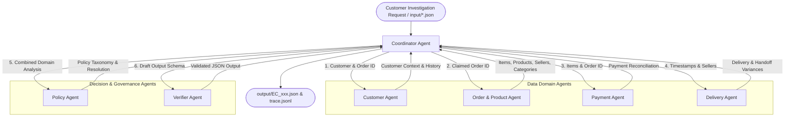

# Multi-Agent Architecture for E-commerce Dispute Resolution

## 1. System Overview

Hệ thống điều tra khiếu nại thương mại điện tử (Multi-Agent E-commerce Dispute Resolution) được thiết kế theo kiến trúc **Multi-Agent A2A (Agent-to-Agent)** với mô hình phân cấp điều phối bởi **Coordinator Agent**. 

Hệ thống phân tách trách nhiệm giữa các Agent chuyên biệt theo từng miền dữ liệu nhằm đảm bảo tính xác thực, khả năng đối soát độc lập và tuân thủ tuyệt đối bộ quy tắc `EC_POLICY_V2`.

---

## 2. Agent Roles and Access Permissions

| Agent Name | Role / Function | Data Access & Permissions | Input | Output / Handoff |
| :--- | :--- | :--- | :--- | :--- |
| **Coordinator Agent** | Lập kế hoạch, điều phối luồng làm việc, tổng hợp bằng chứng và ghi trace log. | Full read/write access to input/output files & trace log. | `input/EC_xxx.json` | Final output JSON, `trace.jsonl` |
| **Customer Agent** | Truy vết nhận dạng khách hàng (`customer_unique_id`) và lịch sử các đơn hàng trước đó. | Read-only: `olist_customers_dataset.csv`, `olist_orders_dataset.csv`. | `customer_id`, `claimed_order_id` | `customer_unique_id`, `related_order_ids` (max 5) |
| **Order & Product Agent** | Phân tích chi tiết danh mục item, nhà bán hàng (`seller_id`), sản phẩm (`product_id`) và danh mục hàng. | Read-only: `olist_order_items_dataset.csv`, `olist_products_dataset.csv`, `product_category_name_translation.csv`. | `claimed_order_id` | `item_ids`, `seller_ids`, `product_ids`, `category_names`, `items_detail` |
| **Payment Agent** | Tính tổng thanh toán (`payment_value`), đối soát với tổng tiền hàng + cước vận chuyển. | Read-only: `olist_order_payments_dataset.csv`. | `claimed_order_id`, `items_detail` | `payment_ids`, `reconciliation` (item_total, freight_total, expected_total, difference, reconciled) |
| **Delivery Agent** | Tính độ lệch giao hàng (`delivery_variance_hours`) và độ lệch bàn giao của nhà bán hàng (`handoff_variance_hours`). | Read-only: `olist_orders_dataset.csv`. | `order_row`, `items_detail` | `delivered_at`, `estimated_delivery_at`, `carrier_handoff_at`, `seller_handoff_analysis`, `late_handoff_seller_ids` |
| **Policy Agent** | Áp dụng quy tắc `EC_POLICY_V2`, phân loại sự cố chính/phụ, bên chịu trách nhiệm, khoản hoàn tiền và hành động xử lý. | Rules Engine (No direct DB write). | Domain analysis outputs from all sub-agents | `primary_issue`, `secondary_issues`, `cause_code`, `responsible_parties`, `recommended_refund_brl`, `resolution_actions` |
| **Verifier Agent** | Kiểm tra tính hợp lệ của JSON Schema, giới hạn độ dài mảng, format `evidence_ids`, xử lý `null` và làm tròn số. | Final Output Guardrail. | Output draft payload | Validated final output payload |

---

## 3. Data Handoff Sequence & Control Flow

1. **Initialization**: Coordinator Agent đọc từng trường hợp khiếu nại `EC_xxx.json` từ `input/`.
2. **Step 1 - Identity Resolution**: Coordinator chuyển `customer_id` sang `CustomerAgent` để tra cứu `customer_unique_id` và các đơn hàng liên quan trong quá khứ.
3. **Step 2 - Order & Inventory Extraction**: Coordinator gửi `claimed_order_id` tới `OrderProductAgent` để lấy danh sách item, thông tin sản phẩm, danh mục và người bán.
4. **Step 3 - Financial Reconciliation**: Coordinator chuyển `items_detail` tới `PaymentAgent` để tính toán tổng giá trị sản phẩm (`item_total_brl`), phí vận chuyển (`freight_total_brl`), tổng đối soát thanh toán (`payment_total_brl`) và trạng thái `reconciled` (chấp nhận sai lệch $\le 0.10$ BRL).
5. **Step 4 - Logistics & Handoff Analysis**: Coordinator chuyển mốc thời gian đơn hàng và thông tin seller tới `DeliveryAgent` để tính thời gian chậm trễ giao hàng và xác định các seller bàn giao muộn so với `shipping_limit_date`.
6. **Step 5 - Policy Resolution**: Coordinator tập hợp tất cả dữ liệu trung gian và chuyển cho `PolicyAgent` để áp dụng thứ tự ưu tiên nguyên nhân chính/phụ và mức hoàn tiền.
7. **Step 6 - Schema Verification & Audit**: Coordinator gửi dữ liệu cho `VerifierAgent` để đảm bảo không vi phạm giới hạn dữ liệu (tối đa 5 order IDs, 20 evidence IDs,...), định dạng lại `evidence_ids` chính xác và xuất ra file trong `output/`.

---

## 4. Evidence ID Formatting Rules

Bằng chứng (`evidence_ids`) được định dạng chuẩn hóa theo quy tắc:
- `order:<order_id>`
- `item:<order_id>:<order_item_id>`
- `payment:<order_id>:<payment_sequential>`
- `seller:<seller_id>` (Chỉ thêm khi seller chịu trách nhiệm)
- `policy:<root_cause_code>` (Ví dụ: `policy:SELLER_HANDOFF_AFTER_LIMIT`)
