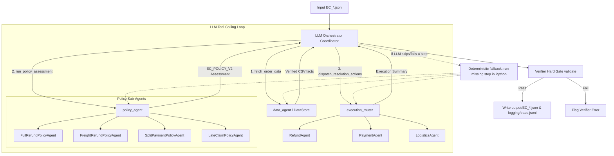

# Architecture & Multi-Agent Design — `ecom-multi-agent`

## 1. System Overview

The `ecom-multi-agent` system processes customer dispute cases (`input/EC_*.json`) over the Brazilian E-Commerce Public Dataset (Olist).
The architecture uses **LLM Routing (Tool Calling)** for case coordination with a **deterministic fallback guarantee**, **Database Fact Isolation** via `data_agent`, **Modular Deterministic Policy Sub-Agents** for business logic evaluation (`EC_POLICY_V2`), an **Execution Router** for action dispatch, and a **Deterministic Verifier Hard Gate** before saving outputs.

---

## 2. Agent Roles & Responsibilities

| Agent / Module | Primary Role | System Prompt / Mechanism | Access Permissions |
| :--- | :--- | :--- | :--- |
| **`LLMOrchestrator`** (`orchestrator/`) | Dynamic routing & step sequencing via tool calling | `orchestrator/system_prompt.md` Coordinator prompt, `AgentExecutor` (LangChain `create_tool_calling_agent`) | No direct CSV access; uses state-encapsulated tools (`fetch_order_data`, `run_policy_assessment`, `dispatch_resolution_actions`); falls back to a deterministic call sequence if `OPENAI_API_KEY`/`OPENROUTER_API_KEY` is missing or the LLM skips a step |
| **`DataAgent`** (`data_agent/`) | Data retrieval & table joins over Olist dataset | `investigate()` is a pure deterministic `DataStore` lookup (no LLM); a separate `chat()` method offers an LLM+tool-calling path for free-text questions but is not used by the pipeline | Exclusive read access to `data/*.csv` |
| **`PolicyAgent`** (`policy_agent/`) | High-level policy orchestrator | Delegates domain checks to sub-agents; no LLM call of its own | Reads `data_agent` bundle; no direct disk mutation |
| ├── `FullRefundPolicyAgent` | Evaluates full refund policies (`canceled_order_paid`, `unavailable_order_paid`) | Deterministic `EC_POLICY_V2` rule check in `evaluate()`; if an API key is present it also issues an LLM confirmation call, but the LLM response is not used in the returned decision | Verified data facts |
| ├── `FreightRefundPolicyAgent` | Evaluates freight refund policies (`late_delivery_seller`, `late_delivery_logistics`) | Deterministic seller handoff & delivery variance check; same unused LLM confirmation hook as above | Verified data facts |
| ├── `SplitPaymentPolicyAgent` | Evaluates multi-payment reconciliation (`valid_split_payment`) | Deterministic payment reconciliation within 0.10 BRL tolerance (no LLM call) | Verified data facts |
| └── `LateClaimPolicyAgent` | Evaluates unsupported late delivery claims (`unsupported_late_claim`) | Deterministic on-time delivery check (no LLM call) | Verified data facts |
| **`ExecutionRouter`** (`execution_agent/`) | Action dispatch & resolution execution | Router pattern dispatching to `RefundAgent`, `PaymentAgent`, `LogisticsAgent` by static `action -> agent` table | Pre-defined action mapping |
| **`Verifier`** (`verifier.py`) | Schema, limit, & internal consistency validation | Python deterministic validation gate | Inspects final assessment before file output |

> **Note on "LLM" in the policy layer:** despite the class names, every policy decision (`primary_issue`, refund amount, evidence, responsible party) is produced by plain Python rules in `rules.py` / `sub_agents/*.py`, so the same input always yields the same output. Two of the four sub-agents additionally fire an LLM call when an API key is configured, but its result is discarded — it is a placeholder confirmation hook, not part of the decision path. Only the top-level `LLMOrchestrator` routing (which tool to call, in what order) is actually LLM-driven, and even that has a deterministic fallback that reproduces the identical `fetch_order_data -> run_policy_assessment -> dispatch_resolution_actions` sequence if the LLM is unavailable or skips a step.

---

## 3. Data Access & Anti-Fabrication Safeguards

1. **Single Source of Truth**: All order, customer, product, seller, payment, and delivery records are loaded strictly from the `data/` CSV files by `DataAgent.investigate()`, which never calls an LLM.
2. **Encapsulated Tool State**: `LLMOrchestrator` wraps case execution inside `_CaseState`. Tools return lightweight status summaries to the LLM (e.g. `{"status": "ok", "found": true}`), preventing raw CSV bundles from overflowing the LLM context.
3. **No Hallucination**: Policy sub-agents compute the assessment from deterministic rules over verified CSV records — there is no generative step in the decision path, so nothing can be invented. Evidence IDs (`order:`, `item:`, `payment:`, `seller:`, `policy:`) match exact database records.
4. **Deterministic Fallback Guarantee**: If the LLM is unavailable (no API key) or its tool-calling loop skips/fails a step, `LLMOrchestrator.run_case()` runs any missing step (`fetch_order_data` -> `run_policy_assessment` -> `dispatch_resolution_actions`) directly in Python, so every case still reaches a result regardless of LLM behavior.
5. **Hard Gate Guarantee**: Output writing and trace logging run in Python after the tool loop completes. The Verifier gate (`validate()`) enforces schema constraints, array length limits, evidence format, and refund/case-status consistency before anything is written to `output/`.
