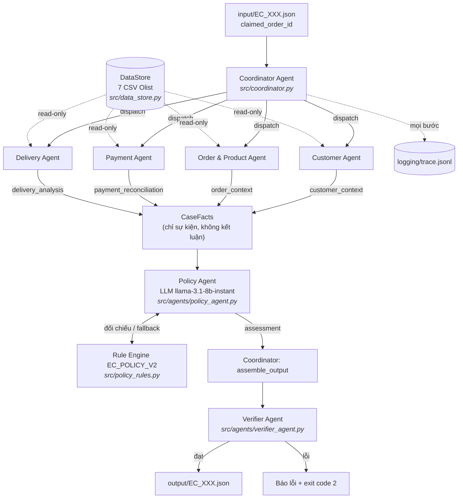

# Kiến trúc hệ thống multi-agent — EC_POLICY_V2

Hệ thống điều tra 50 khiếu nại thương mại điện tử trên dữ liệu Olist bằng 7 agent
có phân công rõ ràng, handoff bằng contract cố định và một bước kiểm chứng độc lập
trước khi ghi file.

## 1. Sơ đồ agent



## 2. Vai trò và quyền truy cập dữ liệu

Nguyên tắc phân quyền: **mỗi agent chỉ đọc đúng những bảng thuộc domain của nó.**
Không agent nào được đọc toàn bộ dataset, và không agent phân tích nào được biết
về policy.

| Agent | File nguồn | Đầu vào | Đầu ra (contract) |
| --- | --- | --- | --- |
| **Coordinator** | — | `input/EC_XXX.json` | điều phối, gom `CaseFacts`, ghi output |
| **Customer Agent** | `olist_customers`, `olist_orders` | `order_id` | `customer_unique_id`, `related_order_ids`, `related_order_count`, `is_repeat_customer` |
| **Order & Product Agent** | `olist_orders`, `olist_order_items`, `olist_products`, `olist_sellers` | `order_id` | `order_status`, `item_ids`, `seller_ids`, `product_ids`, `category_names`, các `*_count` |
| **Payment Agent** | `olist_order_items`, `olist_order_payments` | `order_id` | `item_total_brl`, `freight_total_brl`, `expected_total_brl`, `payment_total_brl`, `difference_brl`, `reconciled`, `payment_types`, `payment_ids` |
| **Delivery Agent** | `olist_orders`, `olist_order_items` | `order_id` | `delivered_at`, `estimated_delivery_at`, `carrier_handoff_at`, `delivery_variance_hours`, `seller_handoff_analysis[]`, `late_handoff_seller_ids`, `is_late_delivery` |
| **Policy Agent** | không đọc CSV — chỉ nhận `CaseFacts` | `CaseFacts` rút gọn | `primary_issue`, `secondary_issues`, `root_cause_code`, `responsible_parties`, `recommended_refund_brl`, `resolution_actions`, `case_status`, `confidence` |
| **Verifier Agent** | `DataStore` (chỉ để đối chiếu ID) | output payload | danh sách vấn đề; rỗng = đạt |

`olist_geolocation_dataset` và `olist_order_reviews_dataset` **không được nạp**:
output schema không dùng đến, nạp thêm chỉ tốn 74MB RAM và thời gian parse.

## 3. Luồng handoff

1. **Dispatch.** Coordinator đọc case, lấy `claimed_order_id`, phát cho 4 agent phân tích.
2. **Thu thập sự kiện.** Mỗi agent trả về một dict đúng contract. Coordinator gom
   thành `CaseFacts`. Đây là ranh giới quan trọng nhất của hệ thống:

   > **Agent phân tích chỉ sản xuất SỰ KIỆN. Chỉ Policy Agent được KẾT LUẬN.**

   Delivery Agent nói *"giao trễ 87.39 giờ, seller X bàn giao muộn 1.04 giờ"* — nó
   không được nói *"đây là late_delivery_seller"*. Nhờ vậy quy tắc nghiệp vụ chỉ
   tồn tại ở đúng một nơi, và Policy Agent thực sự có việc để quyết định.

3. **Quyết định policy.** Policy Agent gửi `CaseFacts` đã rút gọn cho LLM 8B kèm
   toàn văn EC_POLICY_V2, nhận về phân loại dạng JSON.
4. **Kiểm chứng chéo.** Kết quả LLM được đối chiếu với rule engine deterministic:
   - `primary_issue` ngoài taxonomy → hạ xuống kết luận của rule engine;
   - `secondary_issues` sai thứ tự → ép về thứ tự nghiệp vụ;
   - `root_cause_code` không khớp `primary_issue` → sửa theo bảng ánh xạ;
   - mọi sai lệch đều được ghi vào `trace.jsonl` cùng cờ `agrees_with_rule_engine`.
5. **Lắp ráp.** Coordinator dựng payload đúng output schema, sinh evidence ID từ
   dữ liệu thật.
6. **Kiểm tra cuối.** Verifier chạy 12 nhóm kiểm tra. Chỉ khi không còn vấn đề nào
   thì file mới được ghi.

## 4. Phân công tính toán giữa LLM và code

LLM **phân loại**, code **làm toán**. Ranh giới này là có chủ đích:

| Việc | Ai làm | Lý do |
| --- | --- | --- |
| Trừ timestamp ra số giờ | code | model 8B tính chênh lệch ngày giờ không đáng tin |
| Cộng tiền, đối soát ngưỡng 0.10 BRL | code | sai một xu là lật `reconciled`, mất 15% điểm case |
| Chọn `primary_issue` theo 6 quy tắc ưu tiên | **LLM** | đây là phần suy luận chính sách, đúng vai trò của agent |
| Chọn `secondary_issues` | **LLM** | dựa trên các cờ đã tính sẵn |
| Sinh evidence ID | code | ID bịa bị tính false positive |
| Số tiền hoàn, danh sách action | code | suy ra tất định từ `primary_issue` |

Hệ quả: mọi con số trong output đều truy vết được về CSV, còn phần phân loại vẫn do
model đảm nhiệm. Khi không có API key, Policy Agent tự hạ xuống rule engine và ghi
`execution_mode` tương ứng vào `metadata.json` — kết quả vẫn tái lập được 100%.

## 5. Verifier kiểm những gì

Verifier không tin bất kỳ agent nào, kể cả Policy Agent:

1. `primary_issue` thuộc taxonomy 6 giá trị.
2. `secondary_issues` hợp lệ **và đúng thứ tự nghiệp vụ**.
3. `case_status` khớp với `recommended_refund_brl` (> 0 ⇔ `action_required`).
4. `confidence` nằm trong `[0, 1]`.
5. Mọi action thuộc tập 9 action hợp lệ.
6. `valid_split_payment` không kèm `verify_payment_allocation`.
7. `party_type` hợp lệ; seller chịu trách nhiệm phải tồn tại trong `olist_sellers`.
8. `rank` của root cause liên tục từ 1.
9. Timestamp đúng regex `YYYY-MM-DD HH:MM:SS` hoặc `null`.
10. Mọi array trong giới hạn schema.
11. Mọi evidence ID dựng được từ dữ liệu thật (`order:`, `item:`, `payment:`,
    `seller:`, `policy:`) — tra ngược lại `DataStore`.
12. Đơn không có item row có **đúng ba** trường `null`; đơn có item row thì
    `expected_total = item + freight`, `difference = payment − expected`,
    `reconciled = |difference| ≤ 0.10`.

## 6. Cấu trúc mã nguồn

```
run.py                          entry point, CLI, ghi metadata.json
src/
  config.py                     đường dẫn, tên model, giới hạn array, ngưỡng
  data_store.py                 nạp 7 CSV thành index trong RAM
  policy_rules.py               EC_POLICY_V2 deterministic (fallback + đối chiếu)
  llm.py                        client Groq bằng stdlib, đọc key từ .env
  trace.py                      ghi trace.jsonl, đo thời gian từng bước
  coordinator.py                điều phối, lắp ráp output
  agents/
    customer_agent.py
    order_product_agent.py
    payment_agent.py
    delivery_agent.py
    policy_agent.py             LLM + kiểm chứng chéo
    verifier_agent.py
```

Toàn bộ chỉ dùng thư viện chuẩn Python — không pandas, không SDK ngoài. Dataset lớn
nhất chỉ 112k dòng nên `csv` của stdlib thừa sức, đổi lại loại bỏ hoàn toàn rủi ro
không cài được dependency trong lúc thi.

## 7. Cách chạy

```bash
python run.py                 # dùng LLM nếu có GROQ_API_KEY, không thì rule engine
python run.py --no-llm        # ép chạy deterministic
python run.py --case EC_001   # chạy một case để debug
```

Đầu ra: `output/EC_001.json` … `EC_050.json`, `logging/trace.jsonl` (ghi đè mỗi lần
chạy, không append), `logging/metadata.json`.

## 8. Kết quả lượt chạy gần nhất

50/50 case qua Verifier không lỗi. Phân bố `primary_issue`:

| primary_issue | Số case |
| --- | ---: |
| `late_delivery_seller` | 10 |
| `late_delivery_logistics` | 10 |
| `canceled_order_paid` | 8 |
| `valid_split_payment` | 8 |
| `unsupported_late_claim` | 8 |
| `unavailable_order_paid` | 6 |

Sáu case `unavailable_order_paid` (EC_012, EC_031, EC_033, EC_034, EC_035, EC_043)
là các đơn không có item row — đúng ba trường `expected_total_brl`,
`difference_brl`, `reconciled` là `null`, `seller_handoff_analysis` rỗng.
