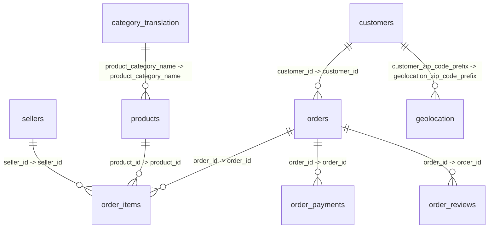

# Data Schema

Auto-generated documentation for the 9 CSV files in [`data/`](data/) — the Olist Brazilian e-commerce public dataset.

**Schema artifact**: [claude.ai/code/artifact/6e3f0ec7-3099-48bf-8316-e53e587e75b4?via=auto_preview](https://claude.ai/code/artifact/6e3f0ec7-3099-48bf-8316-e53e587e75b4?via=auto_preview)

## Overview

| Table                                     | Rows    | Columns | Size (MB) | Description                                                                 |
| ----------------------------------------- | ------- | ------- | --------- | --------------------------------------------------------------------------- |
| `olist_customers_dataset.csv`           | 99441   | 5       | 8.71      | Customer identifiers and location (city/state/zip) for each order.          |
| `olist_geolocation_dataset.csv`         | 1000163 | 5       | 59.39     | Brazilian zip code prefixes mapped to lat/lng coordinates, city, and state. |
| `olist_order_items_dataset.csv`         | 112650  | 7       | 14.83     | Line items within each order: product, seller, price, and freight value.    |
| `olist_order_payments_dataset.csv`      | 103886  | 5       | 5.61      | Payment details for each order, including payment type and installments.    |
| `olist_order_reviews_dataset.csv`       | 99224   | 7       | 13.78     | Customer review scores and comments left for orders.                        |
| `olist_orders_dataset.csv`              | 99441   | 8       | 16.93     | Core order records with status and purchase/delivery timestamps.            |
| `olist_products_dataset.csv`            | 32951   | 9       | 2.3       | Product catalog with category, dimensions, and weight.                      |
| `olist_sellers_dataset.csv`             | 3095    | 4       | 0.17      | Seller identifiers and location (city/state/zip).                           |
| `product_category_name_translation.csv` | 71      | 2       | 0.0       | Maps Portuguese product category names to English.                          |

## Entity-Relationship Diagram

## Table Details

### `olist_customers_dataset.csv`

Customer identifiers and location (city/state/zip) for each order.

- Rows: 99441
- Columns: 5
- File size: 8.71 MB

| Column                       | Type   | Nulls (%) | Unique | Description                                              | Sample                               |
| ---------------------------- | ------ | --------- | ------ | -------------------------------------------------------- | ------------------------------------ |
| `customer_id`              | object | 0 (0.0%)  | 99441  | Order-specific customer key (join key for orders table). | `06b8999e2fba1a1fbc88172c00ba8bc7` |
| `customer_unique_id`       | object | 0 (0.0%)  | 96096  | Stable identifier for a customer across multiple orders. | `861eff4711a542e4b93843c6dd7febb0` |
| `customer_zip_code_prefix` | int64  | 0 (0.0%)  | 14994  | First digits of the customer's zip code.                 | `14409`                            |
| `customer_city`            | object | 0 (0.0%)  | 4119   | Customer's city.                                         | `franca`                           |
| `customer_state`           | object | 0 (0.0%)  | 27     | Customer's state (2-letter code).                        | `SP`                               |

### `olist_geolocation_dataset.csv`

Brazilian zip code prefixes mapped to lat/lng coordinates, city, and state.

- Rows: 1000163
- Columns: 5
- File size: 59.39 MB

| Column                          | Type    | Nulls (%) | Unique | Description                           | Sample                 |
| ------------------------------- | ------- | --------- | ------ | ------------------------------------- | ---------------------- |
| `geolocation_zip_code_prefix` | int64   | 0 (0.0%)  | 19015  | First digits of a Brazilian zip code. | `1037`               |
| `geolocation_lat`             | float64 | 0 (0.0%)  | 717360 | Latitude.                             | `-23.54562128115268` |
| `geolocation_lng`             | float64 | 0 (0.0%)  | 717613 | Longitude.                            | `-46.63929204800168` |
| `geolocation_city`            | object  | 0 (0.0%)  | 8011   | City name.                            | `sao paulo`          |
| `geolocation_state`           | object  | 0 (0.0%)  | 27     | State (2-letter code).                | `SP`                 |

### `olist_order_items_dataset.csv`

Line items within each order: product, seller, price, and freight value.

- Rows: 112650
- Columns: 7
- File size: 14.83 MB

| Column                  | Type    | Nulls (%) | Unique | Description                                        | Sample                               |
| ----------------------- | ------- | --------- | ------ | -------------------------------------------------- | ------------------------------------ |
| `order_id`            | object  | 0 (0.0%)  | 98666  | Foreign key to olist_orders_dataset.order_id.      | `00010242fe8c5a6d1ba2dd792cb16214` |
| `order_item_id`       | int64   | 0 (0.0%)  | 21     | Sequential item number within the order.           | `1`                                |
| `product_id`          | object  | 0 (0.0%)  | 32951  | Foreign key to olist_products_dataset.product_id.  | `4244733e06e7ecb4970a6e2683c13e61` |
| `seller_id`           | object  | 0 (0.0%)  | 3095   | Foreign key to olist_sellers_dataset.seller_id.    | `48436dade18ac8b2bce089ec2a041202` |
| `shipping_limit_date` | object  | 0 (0.0%)  | 93318  | Seller's deadline to hand the item to the carrier. | `2017-09-19 09:45:35`              |
| `price`               | float64 | 0 (0.0%)  | 5968   | Item price.                                        | `58.9`                             |
| `freight_value`       | float64 | 0 (0.0%)  | 6999   | Freight/shipping cost for the item.                | `13.29`                            |

### `olist_order_payments_dataset.csv`

Payment details for each order, including payment type and installments.

- Rows: 103886
- Columns: 5
- File size: 5.61 MB

| Column                   | Type    | Nulls (%) | Unique | Description                                                    | Sample                               |
| ------------------------ | ------- | --------- | ------ | -------------------------------------------------------------- | ------------------------------------ |
| `order_id`             | object  | 0 (0.0%)  | 99440  | Foreign key to olist_orders_dataset.order_id.                  | `b81ef226f3fe1789b1e8b2acac839d17` |
| `payment_sequential`   | int64   | 0 (0.0%)  | 29     | Sequence number for orders paid with multiple payment methods. | `1`                                |
| `payment_type`         | object  | 0 (0.0%)  | 5      | Payment method (e.g. credit_card, boleto, voucher).            | `credit_card`                      |
| `payment_installments` | int64   | 0 (0.0%)  | 24     | Number of installments chosen.                                 | `8`                                |
| `payment_value`        | float64 | 0 (0.0%)  | 29077  | Amount paid via this payment record.                           | `99.33`                            |

### `olist_order_reviews_dataset.csv`

Customer review scores and comments left for orders.

- Rows: 99224
- Columns: 7
- File size: 13.78 MB

| Column                      | Type   | Nulls (%)      | Unique | Description                                   | Sample                                    |
| --------------------------- | ------ | -------------- | ------ | --------------------------------------------- | ----------------------------------------- |
| `review_id`               | object | 0 (0.0%)       | 98410  | Unique review identifier.                     | `7bc2406110b926393aa56f80a40eba40`      |
| `order_id`                | object | 0 (0.0%)       | 98673  | Foreign key to olist_orders_dataset.order_id. | `73fc7af87114b39712e6da79b0a377eb`      |
| `review_score`            | int64  | 0 (0.0%)       | 5      | Rating from 1 to 5.                           | `4`                                     |
| `review_comment_title`    | object | 87656 (88.34%) | 4527   | Optional review title.                        | `recomendo`                             |
| `review_comment_message`  | object | 58247 (58.7%)  | 36159  | Optional review text.                         | `Recebi bem antes do prazo estipulado.` |
| `review_creation_date`    | object | 0 (0.0%)       | 636    | Timestamp the review was created.             | `2018-01-18 00:00:00`                   |
| `review_answer_timestamp` | object | 0 (0.0%)       | 98248  | Timestamp the seller/platform responded.      | `2018-01-18 21:46:59`                   |

### `olist_orders_dataset.csv`

Core order records with status and purchase/delivery timestamps.

- Rows: 99441
- Columns: 8
- File size: 16.93 MB

| Column                            | Type   | Nulls (%)    | Unique | Description                                                | Sample                               |
| --------------------------------- | ------ | ------------ | ------ | ---------------------------------------------------------- | ------------------------------------ |
| `order_id`                      | object | 0 (0.0%)     | 99441  | Unique order identifier (primary key).                     | `e481f51cbdc54678b7cc49136f2d6af7` |
| `customer_id`                   | object | 0 (0.0%)     | 99441  | Foreign key to olist_customers_dataset.customer_id.        | `9ef432eb6251297304e76186b10a928d` |
| `order_status`                  | object | 0 (0.0%)     | 8      | Order status (e.g. delivered, shipped, canceled).          | `delivered`                        |
| `order_purchase_timestamp`      | object | 0 (0.0%)     | 98875  | Timestamp the order was placed.                            | `2017-10-02 10:56:33`              |
| `order_approved_at`             | object | 160 (0.16%)  | 90733  | Timestamp payment was approved.                            | `2017-10-02 11:07:15`              |
| `order_delivered_carrier_date`  | object | 1783 (1.79%) | 81018  | Timestamp order was handed to the logistics carrier.       | `2017-10-04 19:55:00`              |
| `order_delivered_customer_date` | object | 2965 (2.98%) | 95664  | Timestamp order was delivered to the customer.             | `2017-10-10 21:25:13`              |
| `order_estimated_delivery_date` | object | 0 (0.0%)     | 459    | Estimated delivery date shown to the customer at purchase. | `2017-10-18 00:00:00`              |

### `olist_products_dataset.csv`

Product catalog with category, dimensions, and weight.

- Rows: 32951
- Columns: 9
- File size: 2.3 MB

| Column                         | Type    | Nulls (%)   | Unique | Description                                                  | Sample                               |
| ------------------------------ | ------- | ----------- | ------ | ------------------------------------------------------------ | ------------------------------------ |
| `product_id`                 | object  | 0 (0.0%)    | 32951  | Unique product identifier (primary key).                     | `1e9e8ef04dbcff4541ed26657ea517e5` |
| `product_category_name`      | object  | 610 (1.85%) | 73     | Category name in Portuguese (join key to translation table). | `perfumaria`                       |
| `product_name_lenght`        | float64 | 610 (1.85%) | 66     | Character length of the product name.                        | `40.0`                             |
| `product_description_lenght` | float64 | 610 (1.85%) | 2960   | Character length of the product description.                 | `287.0`                            |
| `product_photos_qty`         | float64 | 610 (1.85%) | 19     | Number of photos listed for the product.                     | `1.0`                              |
| `product_weight_g`           | float64 | 2 (0.01%)   | 2204   | Product weight in grams.                                     | `225.0`                            |
| `product_length_cm`          | float64 | 2 (0.01%)   | 99     | Product length in cm.                                        | `16.0`                             |
| `product_height_cm`          | float64 | 2 (0.01%)   | 102    | Product height in cm.                                        | `10.0`                             |
| `product_width_cm`           | float64 | 2 (0.01%)   | 95     | Product width in cm.                                         | `14.0`                             |

### `olist_sellers_dataset.csv`

Seller identifiers and location (city/state/zip).

- Rows: 3095
- Columns: 4
- File size: 0.17 MB

| Column                     | Type   | Nulls (%) | Unique | Description                             | Sample                               |
| -------------------------- | ------ | --------- | ------ | --------------------------------------- | ------------------------------------ |
| `seller_id`              | object | 0 (0.0%)  | 3095   | Unique seller identifier (primary key). | `3442f8959a84dea7ee197c632cb2df15` |
| `seller_zip_code_prefix` | int64  | 0 (0.0%)  | 2246   | First digits of the seller's zip code.  | `13023`                            |
| `seller_city`            | object | 0 (0.0%)  | 611    | Seller's city.                          | `campinas`                         |
| `seller_state`           | object | 0 (0.0%)  | 23     | Seller's state (2-letter code).         | `SP`                               |

### `product_category_name_translation.csv`

Maps Portuguese product category names to English.

- Rows: 71
- Columns: 2
- File size: 0.0 MB

| Column                            | Type   | Nulls (%) | Unique | Description                                                         | Sample            |
| --------------------------------- | ------ | --------- | ------ | ------------------------------------------------------------------- | ----------------- |
| `product_category_name`         | object | 0 (0.0%)  | 71     | Category name in Portuguese (primary key, joins to products table). | `beleza_saude`  |
| `product_category_name_english` | object | 0 (0.0%)  | 71     | Category name translated to English.                                | `health_beauty` |
